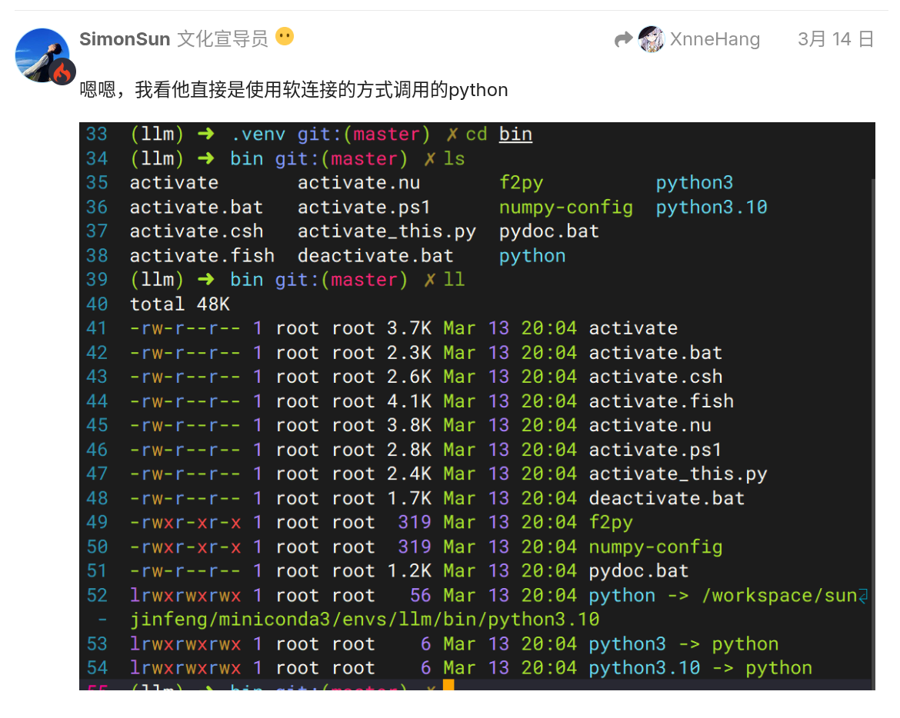

<h1 align="center">使用 python-install-mirror 从镜像源下载 python</h1>

**.venv 下的 python 只是一个软连接**



`.venv` 下的 python 并不是完整的, 所以在我像以前打包 conda 项目那样把包含环境的完整目录压缩传给用户后, 用户在运行 `.bat` 文件时, 它找不到 python (试图从我打包时的系统路径里寻找):

```shell
C:\Users\Administrator\Pictures\yutto-uiya-v1.1.4-pre>.\uv\uv.exe run streamlit run .\src\uiya\yutto_uiya.py
error: Querying Python at `C:\Users\Administrator\Pictures\yutto-uiya-v1.1.4-pre\.venv\Scripts\python.exe` failed with exit status exit code: 103
[stderr] did not find executable at 'C:\Users\Zhouyuan\AppData\Roaming\uv\python\cpython-3.13.2-windows-x86_64-none\python.exe': ???????????                                                                                                                                                                  C:\Users\Administrator\Pictures\yutto-uiya-v1.1.4-pre>pause
```

uv 的 `.venv` 和 `conda env` 不同, `conda env` 每创建一个环境虚拟环境都包含一个 python 和运行库, 而 uv 是直接从系统里面寻找, 然后创建软链接:

```shell
If Python is already installed on your system, uv will detect and use it without configuration. However, uv can also install and manage Python versions. uv automatically installs missing Python versions as needed — you don't need to install Python to get started.
如果系统中已经安装了 Python，uv 将检测并使用它，而无需配置。uv 会根据需要自动安装缺失的 Python 版本，因此无需安装 Python 即可开始使用。
```

这个特性看似很聪明, 但是它不可避免地造成了, `.venv` 不能独立使用, 不像 conda 那样子把 `env` 复制粘贴到另一个人电脑上也依然能用.

而用户在 uv 自动安装 python 和依赖的时候， 默认需要连接外网， 必然是会存在网络不可达的情况的。

那么，如何把自己写好的 uv 项目传递给那些可能网络上存在障碍的用户呢？ 答案是使用镜像源。

对于 python 包, 我们也可以用 `[[tool.uv.index]]` 来替换 pypi 为清华源, 具体参考`[[tool.uv.index]]`章节。

而对于 python(python_build_stand_alone), 我们其实也可以使用镜像, 不过藏得相当深。

参考:

- [官方文档中的 python-install-mirror 词条](https://docs.astral.sh/uv/reference/settings/#python-install-mirror)

- [我们将要使用的镜像源](https://github.com/tuna/issues/issues/2125)

可以得知, 我们可以简单地在 `pyproject.toml` 中加上这么一段来替换 python 镜像.

```toml
[tool.uv]
# 下载 Python 的镜像
python-install-mirror = "https://github.com/astral-sh/python-build-standalone/releases/download" # 官方的默认镜像, 直接从 github 安装, 需要连接外网, 官方默认配置
# python-install-mirror = "https://mirror.nju.edu.cn/github-release/indygreg/python-build-standalone/" # 使用南京大学的镜像, 可能需要更新 uv 到新版本.
```

目前似乎只有南京源支持 `python-install-mirror` , 清华源似乎没有计划支持它.

另外, 应该保证使用尽量新的 uv, 因为旧的 uv 似乎不支持该特性.
